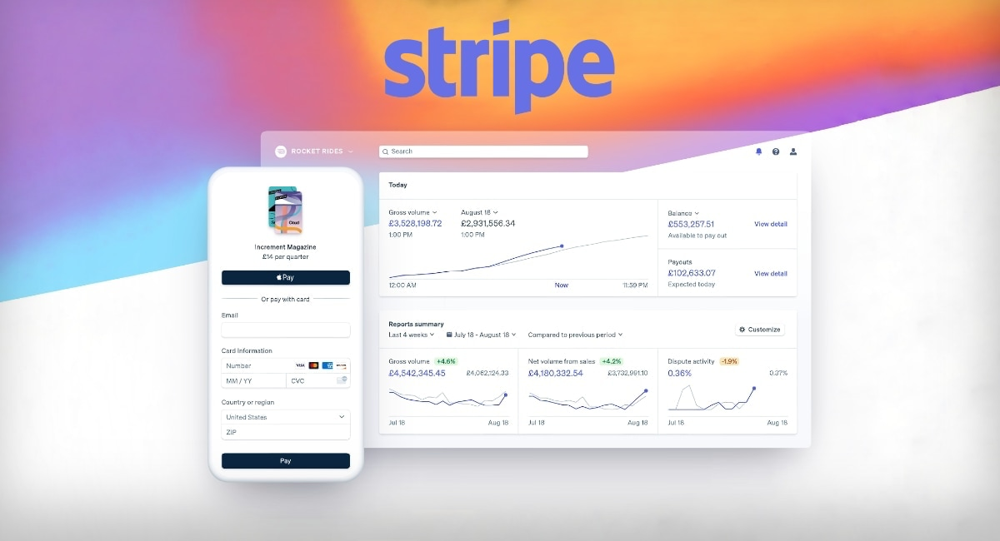

 
Há cerca de um ano, eu e alguns amigos decidimos nos unir para criar uma startup: a **MalDec Labs**. Nosso objetivo era fornecer uma solução robusta para auxiliar profissionais de segurança na análise de ameaças digitais. Foi assim que nasceu o **Infinity**.

O **Infinity** era uma engine avançada de análise de arquivos binários, projetada para atender profissionais que exigem precisão, alto desempenho e flexibilidade. Com integração nativa com ferramentas consagradas como **YARA** e **ClamAV**, o Infinity permitia detectar assinaturas de malware de forma rápida, confiável e eficiente.

Minha responsabilidade dentro do projeto era desenvolver um back-end que gerenciaria as contas dos usuários da aplicação, incluindo autenticação, controle de acesso e integração com o restante do sistema.  Além disso, trabalhei na implementação da comunicação entre a interface web e a engine Infinity, garantindo que os dados analisados fossem corretamente processados e retornados em tempo real e também no sistema de download do próprio Infinity para que os usuários pudessem executar a ferramenta localmente.

Um dos principais desafios durante o desenvolvimento do **Spider** (nome que dei ao back-end no repositório) foi a implementação do sistema de pagamentos e assinaturas. Dentro da nossa regra de negócio, definimos três tipos de conta para uso do Infinity: **Free**, **Basic** e **Business** — cada uma com permissões e recursos diferentes, limitando ou liberando funcionalidades conforme o plano escolhido pelo usuário.

Como tínhamos um prazo apertado para entregar a primeira versão do projeto, após muita pesquisa, encontrei no **Stripe** a melhor solução para gerenciar pagamentos e assinaturas. No início, tive certa dificuldade para entender o funcionamento da plataforma, mas, após compreender sua estrutura e realizar a integração com o Spider, conseguimos implementar um fluxo funcional, seguro e estável — o que trouxe um resultado excelente para o projeto.

## Sobre o Stripe

<picture>
    
</picture>

O Stripe é uma plataforma global de pagamentos amplamente utilizada por empresas de todos os tamanhos para processar pagamentos online de forma rápida, segura e escalável. Com suporte a mais de 135 moedas e diversos métodos de pagamento, como cartões de crédito, débito, PIX e carteiras digitais, o Stripe facilita a integração de sistemas de cobrança e gerenciamento de assinaturas recorrentes em aplicações web e mobile. Sua API robusta e bem documentada permite que desenvolvedores criem experiências de pagamento personalizadas com facilidade — o que a torna uma das soluções favoritas do mercado para e-commerce, SaaS e marketplaces.

## Por que o Stripe é uma boa opção?

Se você já implementou um sistema de pagamento do zero, ou já ouviu algum relato sobre, deve ter noção de que não é algo tão simples de se fazer. Envolve um sequencia de varias etapas no desenvolvimento que vão desde a integração com gateways financeiros, validação de dados sensíveis, tratamento de falhas de pagamento, até a conformidade com padrões de segurança como o PCI DSS.

Além disso, é preciso pensar em questões como recorrência de cobranças, atualização de métodos de pagamento, emissão de faturas, comunicação com o cliente e muito mais. No meu caso quando estava na MalDec trabalhando no Spider, não tínhamos muito tempo para implementar tudo isso e estávamos precisando colocar a projeto no ar.

É justamente nesse cenário que o **Stripe** se destaca como uma das melhores opções disponíveis, aqui estão alguns dos principais motivos que fazem do Stripe uma excelente escolha: 

- **Segurança como prioridade**: conformidade nativa com **PCI DSS**, eliminando a necessidade de lidar diretamente com dados sensíveis dos usuários.
- **Recursos completos**: suporte a **assinaturas**, **planos customizáveis**, **cupons**, **notificações via webhook**, entre outros.
- **Suporte internacional**: aceitação de múltiplas moedas e métodos de pagamento, ideal para aplicações que visam escala global.
- **Ambiente de testes robusto**: sandbox com simulação de cenários reais, perfeito para desenvolvimento e validação.
- **Dashboard intuitivo**: painel de controle para monitorar transações, gerenciar clientes e acompanhar métricas de cobrança com facilidade.

Com o Stripe, é possível economizar tempo de desenvolvimento reduzindo a complexidade do código e oferecer uma **experiência de pagamento profissional e segura** para seus usuários.