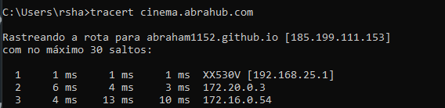
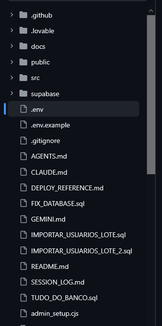
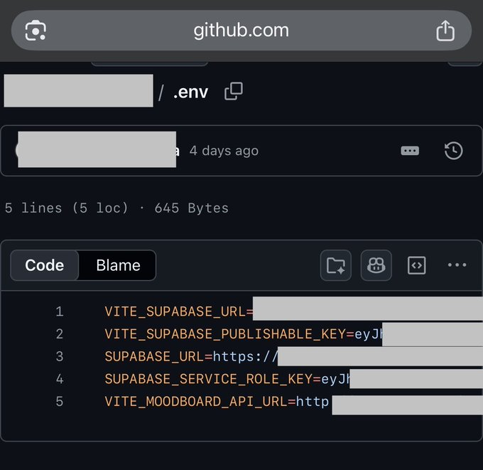
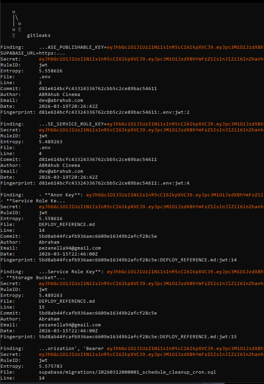
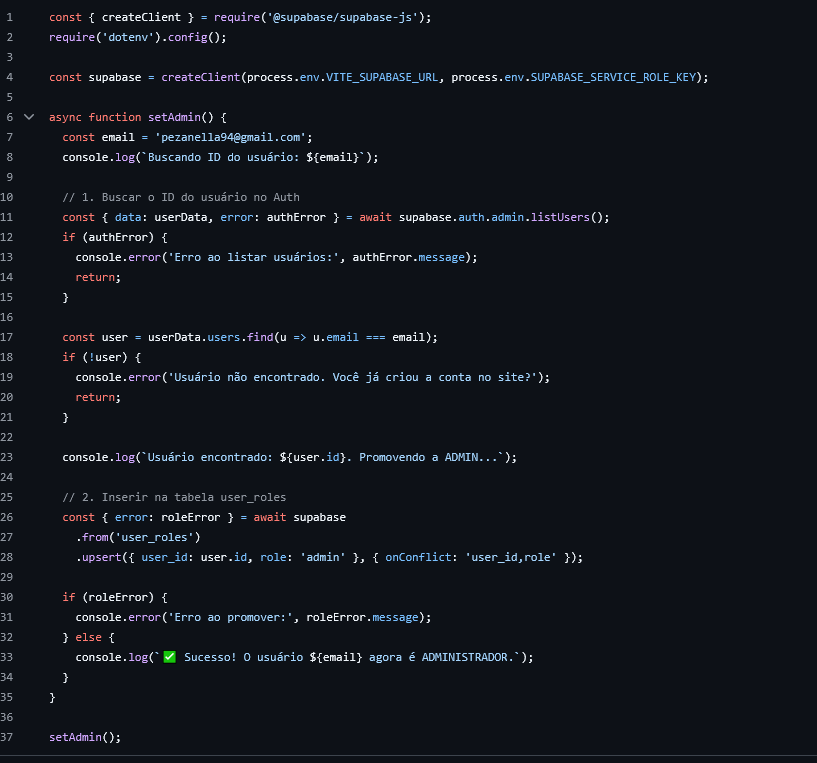
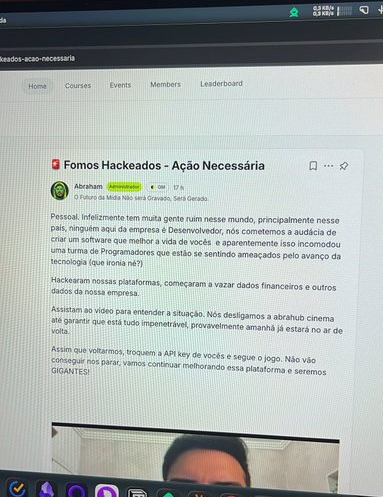

O código escrito por humanos pode estar diminuindo, mas a responsabilidade técnica nunca foi tão alta. Na última semana me deparei com um youtuber “cancelando” a profissão de programador ao mostrar lucros astronômicos com um app feito através de IA, apenas para ter sua aplicação totalmente comprometida minutos depois por erros amadores de infraestrutura.

O youtuber do canal Abraham fez a seguinte postagem no Twitter (atual X): 

Após algum tempo um usuário chamado thiagozf ([@thiagozf](https://x.com/thiagozf)) respondeu à publicação do youtuber: 

Como isso foi possível? Teriam utilizado ferramentas de hacking sofisticadas ou explorado uma vulnerabilidade de dia zero (0-day)? Como uma aplicação que fatura 100k foi exposta em menos de 120 segundos? 

Não foi obra de um grupo hacker de elite, mas sim da ausência dos fundamentos mais básicos de segurança. Enquanto o autor celebrava o fim da ‘barreira do código’, o básico ficou de lado: infraestrutura e segurança. O arquivo `.env` (que deveria ser privado) estava público. Na prática, a aplicação funcionava, mas estava longe de ser segura.

# A autópsia de 120 segundos

Enquanto o post original acumulava curtidas, a comunidade técnica levou menos de dois minutos para realizar uma "autópsia" ao vivo da aplicação. A usuária **Reesha (**[@Reeshasx](https://x.com/Reeshasx)**)** apresentou as principais falhas presentes no repositório **público** do projeto do youtuber presente no github.

### 1. A infraestrutura exposta (O rastro do Tracert)

O primeiro erro foi de arquitetura básica. Ao utilizar o comando `tracert`, foi possível identificar que a aplicação, supostamente robusta e lucrativa, estava rodando simplesmente no **GitHub Pages**.

>*"Consegui toda a source code... consegui a rota para o profile com tracert"*, relatou a usuária.
>

Na prática, não tinha nenhuma camada intermediária: a estrutura do projeto ficou exposta e era fácil de mapear.

### 2. As "Chaves da Mansão" debaixo do tapete

O erro mais fatal, no entanto, não foi apenas uma falha de lógica, mas uma exposição total da infraestrutura. O autor chegou a criar um arquivo `.gitignore`, mas negligenciou a regra número um de qualquer desenvolvedor: **nunca subir variáveis de ambiente para o controle de versão.**

A imagem abaixo circula como o retrato do desastre. Nela, vemos o arquivo `.env` escancarado no repositório público, contendo segredos que jamais deveriam ser vistos:

- **VITE_SUPABASE_URL:** O endereço direto do banco de dados.
- **SUPABASE_SERVICE_ROLE_KEY:** Esta é a "chave mestre". Diferente de uma chave comum, a *Service Role* ignora todas as políticas de segurança (RLS — Row Level Security). Com ela, qualquer pessoa pode ler, alterar ou excluir todos os dados de todos os usuários sem nenhuma restrição.

**O resultado da negligência:** Ao rodar uma ferramenta de auditoria chamada **Gitleaks**, o cenário se provou ainda pior: **7 vazamentos críticos detectados**. Não eram apenas credenciais de teste; eram as chaves de produção de um negócio que, segundo o autor, fatura 100k/mês.

- Chaves do Supabase (Banco de dados);
- Segredos de JWT;
- Credenciais de API.

Na prática, quem encontrasse essas chaves podia mexer nos dados e na operação do sistema sem grande esforço. O que ele chamou de "morte da barreira do código" foi, na prática, a remoção da barreira de proteção dos seus próprios usuários.

### 3. "Admin_setup.cjs": O perigo do código gerado por IA

Uma das capturas de tela mostra um script chamado `admin_setup.cjs`. Nele, vemos a IA tentando resolver um problema de forma "burra": um script manual que usa uma `SERVICE_ROLE_KEY` (uma chave que ignora todas as regras de segurança) para promover um e-mail específico a administrador.

O arquivo ainda revela nomes de arquivos gerados por prompts, como `CLAUDE.md`, `GEMINI.md` e `TUDO_DO_BANCO.sql`. É o retrato fiel de alguém que "pediu um software" para a IA, mas não teve o critério técnico para revisar o que recebeu.

Após a exposição técnica das falhas, o desfecho foi previsível, mas não menos surpreendente. Em vez de uma nota técnica assumindo a responsabilidade pela exposição de dados sensíveis, o que vimos foi a narrativa clássica do "ataque externo".

O comunicado emitido pelo autor da aplicação traz um tom de vitimização que ignora o fato mais básico: **não houve um hackeamento sofisticado**. Quando você deixa a chave da sua casa pendurada na maçaneta, alguém entrar não é um "planejamento de invasão complexo", é consequência de uma negligência.

No post, o autor alega que "programadores se sentiram ameaçados". Na verdade, a comunidade técnica apenas apontou que o "castelo" de 100k/mês estava sendo sustentado por um arquivo `.env` público e uma chave de administrador (`SERVICE_ROLE_KEY`) escancarada. O que o autor chamou de "ataque" foi, na prática, uma auditoria de segurança pública feita em menos de dois minutos.

A maior ironia não é o avanço da tecnologia ameaçar os programadores, mas sim alguém tentar "revolucionar" o mercado de software sem entender o conceito de **variáveis de ambiente** ou **permissões de banco de dados**.

Ao tirar a aplicação do ar e fechar o repositório, o autor admitiu a fragilidade do sistema, mas o comunicado revela um problema ainda maior no VibeCoding: a falta de humildade técnica. Tratar uma falha de segurança crítica que coloca em risco os dados financeiros e pessoais dos usuários como se fosse apenas "*pessoas mal-intencionadas*" é o ápice da irresponsabilidade profissional.

# Invasão ou Negligência Escancarada?

Diante do caos e das acusações de "hackeamento", a narrativa de vitimização do criador do SaaS logo encontrou um obstáculo: a legislação brasileira. O advogado **João de Senzi ([@joaosenzi](https://x.com/joaosenzi))** trouxe uma análise técnica que desarma o argumento de "ataque externo" e coloca a responsabilidade de volta onde ela deveria estar.

### 1. A Falácia da "Invasão" (Art. 154-A do Código Penal)

Muitos acreditam que qualquer acesso não autorizado a dados configura crime. No entanto, juridicamente, o crime de **invasão de dispositivo informático** exige a superação de um obstáculo. Para que haja invasão, é necessário vencer uma barreira, seja uma senha, um firewall ou uma autenticação.

No caso do "VibeCoding" em questão, o repositório foi configurado como **público**. Qualquer pessoa com o link poderia clonar o projeto e ler o código. Como bem pontuou Senzi, não houve "quebra" de proteção, pois não existia proteção alguma.

> *"É como se o cara tivesse deixado a porta da casa escancarada e depois reclamasse que as pessoas entraram. Juridicamente, não cola. Não houve superação de obstáculo."* — **João de Senzi**
> 

### 2. O Verdadeiro Risco: A Violação da LGPD

Se a comunidade não cometeu crime ao acessar o que estava aberto, o mesmo não se pode dizer da gestão dos dados por parte do criador. Ao expor chaves de API e informações sensíveis de terceiros em um ambiente público, o projeto entra em rota de colisão direta com a **LGPD (Lei Geral de Proteção de Dados)**.

O que o autor do SaaS tentou rotular como "ataque" é, na verdade, uma falha gravíssima de tratamento de dados que pode gerar:

- **Responsabilidade Civil:** Indenizações por danos causados aos usuários expostos.
- **Sanções Administrativas:** Multas pesadas aplicadas pela **ANPD** (Autoridade Nacional de Proteção de Dados).
- **Insegurança Jurídica:** Embora a jurisprudência varie, a tese de "fui hackeado" cai por terra quando o próprio administrador deixa as credenciais expostas para o mundo.

### 3. A Vibe vs. A Lei

No fim, a leitura jurídica é simples: o criador promoveu um produto baseado no hype de que "a IA faz tudo", mas ignorou que o Direito não aceita o desconhecimento técnico como desculpa para a exposição de dados alheios. O "VibeCoding" sem fundamentos de segurança não é apenas um erro de programação; é um passivo jurídico que pode custar muito mais caro que o faturamento de 100k.

# Minha visão sobre VibeCoding

Há algum tempo, conversando com um amigo no trabalho, ele tinha me relatado uma discussão no Reddit sobre desenvolvedores preocupados em perder o seu emprego para a IA, sinceramente pelo que venho acompanhando até agora, a minha visão sobre a IA se mantém a mesma até hoje. Os modelos de IA são somente mais uma tecnologia que virou algo essencial na vida de quem trabalha com desenvolvimento hoje em dia.

Para colocar em comparação, basta ver como era antigamente. Se você perguntasse a um desenvolvedor em 2013 o que ele achava do React… *****mano*…

Quando o React apareceu colocando HTML dentro do JavaScript (JSX), muita gente olhou e disse: *"Vocês enlouqueceram? Estamos voltando para os anos 90!"*. Parecia uma bagunça técnica colocar tags dentro do código lógico.

Houve uma grande polêmica com a licença de software do React. O Facebook incluiu uma cláusula de **patentes** que dizia, basicamente: *"Se você processar o Facebook por qualquer patente, você perde o direito de usar o React"*.

- Isso causou um pânico generalizado em empresas grandes.
- A Apache Foundation chegou a banir o uso de bibliotecas com essa licença.
- Só depois de muita pressão da comunidade o Facebook mudou para a licença **MIT** (que é a que usamos hoje).

O React só venceu a "birra" porque, na prática, ele resolvia problemas que o Angular 1.x não conseguia, especialmente em aplicações gigantes e complexas. Quando os desenvolvedores viram que era muito mais fácil dar manutenção em componentes pequenos e isolados, o ódio virou amor (ou pelo menos aceitação de mercado).

> **Curiosidade:** O anúncio original do React na conferência JSConf de 2013 foi tão "odiado" que os palestrantes acharam que tinham arruinado suas carreiras. Hoje, aquele vídeo é histórico.
> 

No fim, quem resistiu por "birra" acabou ficando para trás, enquanto quem entendeu que aquilo era uma ferramenta de produtividade saiu na frente. Eu tenho certeza de que você já deve ter ouvido algo desse tipo: 

> “se você é desenvolvedor e não estiver habituado com as novas tecnologias, você estará defasado no mercado”.
> 

Estar habituado com a IA hoje é requisito básico para ser competitivo. Mas não basta saber apenas escrever prompts. Para não ser o próximo caso de "faturamento alto com segurança zero", é preciso ter noção sobre aquilo que considero os três pilares inegociáveis:

- **Arquitetura (O Esqueleto)**: A IA é mestre em gerar funções isoladas, mas ela não entende a "Big Picture". Uma boa arquitetura é o que garante que seu projeto seja sustentável e escalável. Sem ela, você não tem um software, tem um amontoado de códigos que ninguém consegue dar manutenção.
- **Testes (A Prova de Sanidade)**: O código da IA pode parecer perfeito, mas ela não tem contexto de negócio. Os testes são o que garantem que a lógica gerada pela máquina realmente entrega o que o usuário precisa, sem quebrar o sistema inteiro por um efeito colateral imprevisto.
- **Segurança (O Pilar Mestre)**: Este é o ponto onde o "VibeCoding" amador morre. A segurança deve nascer com o projeto. A IA não vai te avisar que seu arquivo `.env` está público ou que sua chave de administrador está exposta. Ter conhecimento de segurança é o que separa um "curioso de prompt" de um desenvolvedor profissional e responsável.

# Conclusão

A inteligência artificial não veio para roubar o lugar de quem sabe construir; ela veio para dar superpoderes a quem entende os fundamentos. Ela é uma excelente **auxiliar**, mas uma péssima **tomadora de decisões**.

O papel do desenvolvedor mudou: deixamos de ser apenas "digitadores de sintaxe" para nos tornarmos **curadores e arquitetos de sistemas**. O código pode até ser gerado por uma máquina, mas a assinatura e a responsabilidade sobre ele sempre serão humanas. No fim do dia, a ferramenta é a "vibe", mas o fundamento é o que mantém o sistema de pé.