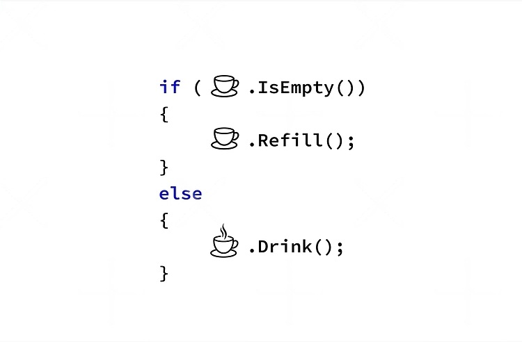

# Introdução ao React Hooks

<picture>
    
</picture>

Lorem ipsum dolor sit amet, consectetur adipiscing elit. Ut cursus tortor non lacus dictum iaculis. Donec viverra ac felis vel vehicula. Nulla commodo ex a justo consectetur cursus. Vestibulum posuere vitae quam ut ornare. Donec venenatis sem quis erat placerat, et egestas diam hendrerit. Maecenas quis massa finibus, molestie erat commodo, vulputate leo. Vivamus ut porttitor metus. Donec venenatis interdum diam. Curabitur faucibus, dui viverra fringilla volutpat, ipsum justo dapibus orci, et molestie lacus nisl nec dui. Aenean vitae dui malesuada, ullamcorper magna sed, efficitur magna. Sed fringilla ultrices bibendum. Duis ac ante massa.

"Curabitur eu ultricies massa, ut auctor enim. Ut quis porta purus, id dictum erat. Mauris maximus odio massa, vehicula hendrerit augue pellentesque vitae."

Email: [renanrocha8897@gmail.com](mailto:renanrocha8897@gmail.com)

- item a
    - 1.1
        - 1.1.1

Curabitur eu ultricies massa, ut auctor enim. Ut quis porta purus, id dictum erat. Mauris maximus odio massa, vehicula hendrerit augue pellentesque vitae. Fusce pretium risus vel nunc luctus molestie. Interdum et malesuada fames ac ante ipsum primis in faucibus. Phasellus massa ligula, accumsan ac fermentum at, varius ut augue. Cras rhoncus commodo nisl, in ullamcorper dui cursus nec.

<picture>
    
</picture>

Duis sed malesuada mi. Nam vestibulum blandit est ut fringilla. Pellentesque enim arcu, euismod vitae efficitur rhoncus, sollicitudin eget elit. Cras nec mauris ac ipsum vulputate gravida non in tellus. Aliquam sed mauris ultrices, hendrerit nulla efficitur, aliquam erat. Nam sodales ligula odio, eget lobortis ligula iaculis sed. Pellentesque hendrerit porttitor eros, eget feugiat erat blandit ac. Sed ultricies dui sit amet condimentum ullamcorper. In posuere eleifend molestie.

```java
public class MaiorNumero {
    public static void main(String[] args) {
        int[] numeros = {5, 12, 7, 3, 25, 18};

        if (numeros.length == 0) {
            System.out.println("O array está vazio. *********************************************************************************************************");
            return;
        }

        int maior = numeros[0];

        for (int numero : numeros) {
            if (numero > maior) {
                maior = numero;
            }
        }

        System.out.println("maior : " + maior);

    }
}
```


Sed maximus dolor in leo sagittis sollicitudin. Sed a efficitur ex, eu vestibulum purus. Quisque dignissim ante mi, non aliquam sapien bibendum ac. Morbi fermentum lectus eu iaculis finibus. Class aptent taciti sociosqu ad litora torquent per conubia nostra, per inceptos himenaeos. Nulla gravida vitae massa vel lobortis. Ut vitae neque non ante pharetra efficitur.

Nam euismod sollicitudin lacus eget tristique. Integer tristique, velit ac vestibulum cursus, turpis risus pharetra mi, sed iaculis elit metus at lacus. Nullam ex purus, viverra quis enim a, ullamcorper vehicula nunc. Aliquam feugiat luctus bibendum. Nullam iaculis tempor quam, ut mollis diam placerat et. Suspendisse semper convallis justo, ac ornare mi facilisis sed. Nam tempus, dolor non dictum viverra, arcu augue consectetur ante, eu tristique magna nisl id ex.

## Subtítulo

Mais conteúdo...

